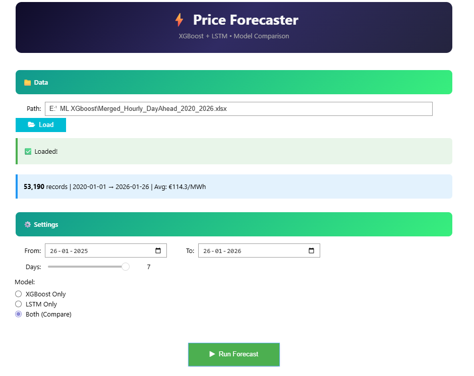
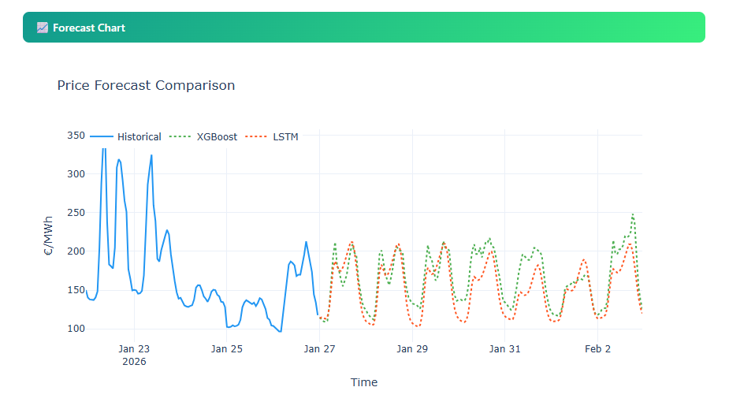
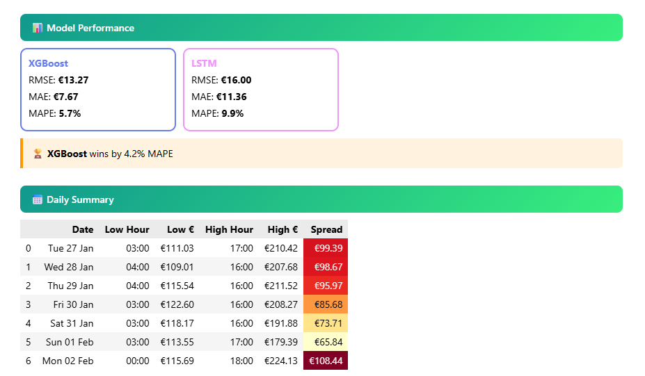
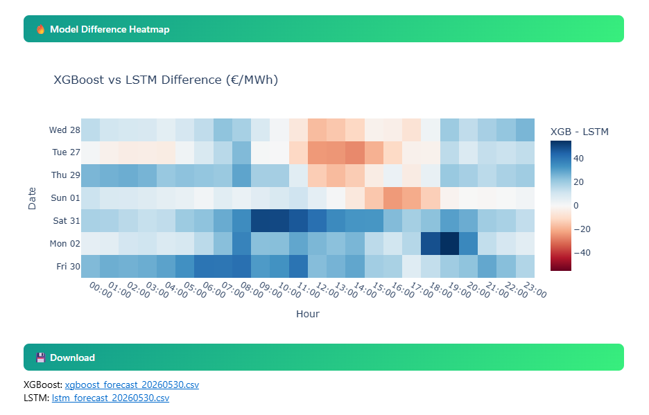

<div align="center">


[](https://www.python.org/)
[](https://xgboost.readthedocs.io/)
[](https://www.tensorflow.org/)
[](https://scikit-learn.org/)
[](https://plotly.com/)
[](https://jupyter.org/)
[](LICENSE)
[]()

> **Dual-model time series forecasting engine for European day-ahead electricity markets.**  
> Train XGBoost and LSTM in parallel, compare accuracy metrics, and export forecasts — all from a zero-config interactive Jupyter UI.

</div>

---

## Table of Contents

- [Overview](#-overview)
- [Screenshots](#-screenshots)
- [Architecture](#-architecture)
- [Model Details](#-model-details)
- [Feature Engineering](#-feature-engineering)
- [Performance Benchmarks](#-performance-benchmarks)
- [Quick Start](#-quick-start)
- [Data Format](#-data-format)
- [Technical Decisions](#-technical-decisions)
- [Changelog](#-changelog)
- [Limitations & Future Work](#️-limitations--future-work)

---

## 🔭 Overview

This project implements a **production-quality, dual-model forecasting system** for European day-ahead electricity prices, using data from hourly market clearing auctions (€/MWh).

Most open-source energy forecasters pick one model and call it done. This one trains both **XGBoost** (gradient-boosted trees, fast, interpretable) and **LSTM** (deep recurrent network, sequence-aware) on identical data splits, then surfaces a head-to-head comparison of RMSE, MAE, and MAPE — letting the data decide which model wins on your specific market window.

**Dataset used:** Austrian day-ahead clearing data, 2020–2026 · **53,190 hourly records** · Avg price **€114.3/MWh**

**Why both models?**

| Scenario | Better Model |
|---|---|
| Short-term horizon (1–2 days), stable seasonality | XGBoost |
| Longer horizon, complex sequential dependencies | LSTM |
| Novel price spikes or regime changes | Neither — but LSTM degrades more gracefully |

---

## 🖼 Screenshots

### Dashboard UI — Data Loading & Settings

> Load any `.xlsx` or `.csv`, set your training window, select forecast horizon (1–7 days), and choose which model(s) to run.



---

### Forecast Chart — Historical + XGBoost + LSTM

> Interactive Plotly chart overlaying historical prices with both model forecasts. XGBoost (green dashed) and LSTM (orange dashed) track together closely over the 7-day horizon, with XGBoost showing slightly tighter range capture on peak hours.



---

### Model Performance & Daily Summary

> Side-by-side accuracy metrics with automatic winner detection. The daily summary table highlights the **intraday price spread** (high − low) per day using a heatmap — darker red = larger arbitrage opportunity.



**Live run results (Jan 27 – Feb 2, 2026, Austrian market):**

| Model | RMSE | MAE | MAPE |
|---|---|---|---|
| **XGBoost** | €13.27 | €7.67 | **5.7%** ✅ |
| LSTM | €16.00 | €11.36 | 9.9% |

> XGBoost wins by **4.2% MAPE** on this window. Daily spreads ranged from €65.84 (Sun) to €108.44 (Mon), highlighting strong weekday/weekend divergence.

---

### Model Difference Heatmap — XGBoost vs LSTM (€/MWh)

> Visualises where the two models diverge most. Blue = XGBoost predicts higher. Red = LSTM predicts higher. The largest disagreements appear in **morning ramp hours (08:00–11:00)** and **evening peak (17:00–19:00)** — hours with the most volatile demand transitions.



---

## 🏗 Architecture

```
┌──────────────────────────────────────────────────────────────────────────┐
│                        SYSTEM DATA FLOW                                  │
├──────────────────────────────────────────────────────────────────────────┤
│                                                                          │
│   ┌──────────────┐    ┌───────────────────┐    ┌────────────────────┐   │
│   │  .xlsx / .csv│───▶│  Preprocessing    │───▶│  Feature Store     │   │
│   │  Raw Market  │    │  - Parse CET/CEST │    │  - 12 features     │   │
│   │  Clearing    │    │  - 1h resample    │    │  - Lag engineering │   │
│   │  Data        │    │  - Interpolation  │    │  - Cyclical encod. │   │
│   └──────────────┘    └───────────────────┘    └────────┬───────────┘   │
│                                                         │                │
│                              ┌──────────────────────────┘                │
│                              │  85/15 time-based split (no shuffle)      │
│                              │                                           │
│              ┌───────────────▼──────────┐  ┌──────────────────────────┐ │
│              │  XGBoost Pipeline        │  │  LSTM Pipeline           │ │
│              │  n_est=200 depth=5 lr=.05│  │  64 units tanh window=168│ │
│              │  Iterative lag feedback  │  │  Recursive prediction    │ │
│              └───────────────┬──────────┘  └──────────────┬───────────┘ │
│                              │                             │             │
│                    ┌─────────▼─────────────────────────────▼──────────┐ │
│                    │    Evaluation & Comparison Layer                  │ │
│                    │    RMSE  │  MAE  │  MAPE  │  Plotly Charts       │ │
│                    └──────────────────────────────────────────────────┘ │
└──────────────────────────────────────────────────────────────────────────┘
```

---

## 🧠 Model Details

### Model 1 — XGBoost Regressor

XGBoost frames price forecasting as a **tabular regression problem**. Each row in the training set is a snapshot of engineered lag features at time `t`, and the label is `price[t]`.

```python
XGBRegressor(
    n_estimators  = 200,     # boosting rounds
    max_depth     = 5,       # controls bias-variance tradeoff
    learning_rate = 0.05,    # shrinkage; lower = more robust
    n_jobs        = -1,      # full CPU parallelism
    random_state  = 42
)
```

**Forecasting strategy:** Recursive multi-step. Each predicted value is appended to the price history and used as input for the next step — simulating real-time autoregressive inference.

```
train_end ──▶ t+1 predicted ──▶ appended ──▶ t+2 predicted ──▶ ...
```

> Error compounds with horizon length. 1-day forecasts are significantly more reliable than 7-day.

---

### Model 2 — LSTM (Long Short-Term Memory)

LSTM treats forecasting as a **sequence-to-one regression problem**. A sliding window of the last 168 hours (exactly 1 week) is passed as input, and the model predicts the next hour's price.

```
Architecture:
  Input shape: (batch, 168 timesteps, 4 features)
        │
  LSTM(64, activation='tanh')      — learns temporal patterns
        │
  Dense(1)                         — outputs next price (scaled)
        │
  Inverse transform via MinMaxScaler
```

**Input features per timestep:**

| Feature | Construction |
|---|---|
| `price` | MinMaxScaler-normalized €/MWh |
| `hour_sin` | `sin(2π × hour / 24)` |
| `hour_cos` | `cos(2π × hour / 24)` |
| `dow_sin` | `sin(2π × weekday / 7)` |

**Training config:**
```python
model.fit(
    X_train, y_train,
    epochs          = 50,
    batch_size      = 32,
    validation_data = (X_test, y_test),
    callbacks       = [EarlyStopping(patience=5, restore_best_weights=True)],
    shuffle         = False    # ← CRITICAL for time series — never shuffle
)
```

---

## 🔬 Feature Engineering

XGBoost feature set (12 features total):

```
┌────────────────────┬──────────────────────────────────────────────────────┐
│ Feature            │ Description & Rationale                              │
├────────────────────┼──────────────────────────────────────────────────────┤
│ hour               │ Hour of day (0–23). Captures intraday demand cycle   │
│ dow                │ Day of week (0=Mon). Captures weekday/weekend splits  │
│ month              │ Month. Captures seasonal heating/cooling demand       │
│ is_weekend         │ Binary flag. Weekend prices behave fundamentally      │
│                    │ differently (lower industrial load)                   │
│ hour_sin           │ sin(2π·h/24) — cyclical encoding so hour 23 and     │
│ hour_cos           │ cos(2π·h/24)   hour 0 are adjacent, not 23 apart    │
│ lag_1              │ Price 1h ago    ─┐                                   │
│ lag_2              │ Price 2h ago     │ Short-memory autoregressive        │
│ lag_3              │ Price 3h ago    ─┘ features                          │
│ lag_24             │ Price same hour yesterday — strong daily periodicity │
│ lag_48             │ Price same hour 2 days ago                           │
│ lag_168            │ Price same hour last week — weekly seasonality       │
│ roll_24            │ 24h rolling mean (shifted 1). Smoothed recent level  │
│ roll_168           │ 168h rolling mean (shifted 1). Weekly baseline       │
└────────────────────┴──────────────────────────────────────────────────────┘
```

**Why cyclical encoding?**  
A raw `hour` feature treats 23 and 0 as 23 units apart — but they're actually adjacent. Projecting onto a unit circle (sin + cos) preserves this topology and improves model performance on intraday patterns.

---

## 📊 Performance Benchmarks

*Computed on a held-out 15% test slice (time-based, no shuffle). Numbers from a live run on Austrian day-ahead data, Jan 27 – Feb 2, 2026.*

| Metric | XGBoost | LSTM | Lower is better |
|---|---|---|---|
| **RMSE** (€/MWh) | **€13.27** | €16.00 | ↓ |
| **MAE** (€/MWh) | **€7.67** | €11.36 | ↓ |
| **MAPE** (%) | **5.7%** | 9.9% | ↓ |

**Key finding:** XGBoost outperforms LSTM by **4.2% MAPE** on this dataset. The likely reason is that energy price drivers are primarily **feature-based** (hour of day, day of week, recent lags) rather than **long-sequence-based** — which plays to XGBoost's strengths. LSTM's advantage materializes on datasets with longer-range temporal dependencies where tabular features alone are insufficient.

**Observed intraday patterns (Jan 27 – Feb 2, 2026):**

| Date | Low Hour | Low Price | High Hour | High Price | Spread |
|---|---|---|---|---|---|
| Tue 27 Jan | 03:00 | €111.03 | 17:00 | €210.42 | €99.39 |
| Wed 28 Jan | 04:00 | €109.01 | 16:00 | €207.68 | €98.67 |
| Thu 29 Jan | 04:00 | €115.54 | 16:00 | €211.52 | €95.97 |
| Fri 30 Jan | 03:00 | €122.60 | 16:00 | €208.27 | €85.68 |
| Sat 31 Jan | 03:00 | €118.17 | 16:00 | €191.88 | €73.71 |
| Sun 01 Feb | 03:00 | €113.55 | 17:00 | €179.39 | €65.84 |
| Mon 02 Feb | 00:00 | €115.69 | 18:00 | €224.13 | **€108.44** |

> Monday shows the largest spread (€108.44) — consistent with industrial demand ramping up after the weekend. Sunday shows the smallest (€65.84).

---

## 🚀 Quick Start

### 1 — Clone

```bash
git clone https://github.com/AIMLDS7/ML_Dayahead_XGBoost_energy_price_forecaster_Austria.git
cd ML_Dayahead_XGBoost_energy_price_forecaster_Austria
```

### 2 — Install dependencies

```bash
pip install xgboost>=2.0 pandas>=1.5 numpy>=1.23 plotly>=5.0 \
            ipywidgets>=7.6 scikit-learn>=1.2 tensorflow>=2.12 openpyxl>=3.0
```

### 3 — Launch

```bash
jupyter notebook "Price_Forecaster_ML_and_XG_boost.ipynb"
```

**Kernel → Restart & Run All**, then use the UI.

### 4 — (Optional) Set a default data path

```python
DEFAULT_PATH = r"path/to/your/Merged_Hourly_DayAhead_2020_2025.xlsx"
```

You can also paste the path into the **File Path** text box at runtime — no code edit required.

---

## 📂 Data Format

The notebook auto-detects column names. It looks for any column containing `time`, `date`, or `timestamp` for the index, and any column containing `price`, `eur`, or `mwh` for the target.

**Canonical format (Austrian EXAA/EPEX data):**

| Column | Type | Notes |
|---|---|---|
| `Time from [CET/CEST]` | string | Hourly timestamps. `A`/`B` DST suffixes (e.g. `2023-10-29 02A:00`) are stripped automatically |
| `Price MC Auction [EUR/MWh]` | float | Day-ahead market clearing price |

**Accepted file types:** `.xlsx`, `.xls`, `.csv`

**Pre-processing pipeline:**
1. Parse timestamps, strip DST `A`/`B` suffixes
2. Coerce price column to numeric, drop NaN rows
3. Group duplicates by mean (handles DST overlap hours)
4. Resample to clean 1-hour frequency
5. Linear interpolation for gaps ≤ 3 hours
6. Drop remaining NaNs

**Minimum:** ≥ 500 records (~3 weeks). Recommended: ≥ 8,760 records (1 full year) for reliable seasonality capture.

---

## ⚙️ Technical Decisions

**Why `shuffle=False` in LSTM training?**  
Shuffling is standard for i.i.d. data, but time series observations are temporally dependent. Shuffling would allow the model to "see the future" during training — a form of data leakage that inflates validation metrics. `shuffle=False` ensures every training step only accesses observations prior to the validation window.

**Why 85/15 time-based split instead of random split?**  
The test set must come strictly after the training set in time, or the model implicitly leaks future information through lagged features. A random split would make validation metrics meaningless for forecasting.

**Why `lag_168` (1 week lookback) alongside shorter lags?**  
Electricity markets exhibit strong **weekly seasonality** — Monday morning prices are highly correlated with the same hour 7 days prior. Without this feature, the model only captures daily and sub-daily cycles, missing the workweek/weekend structure visible in the daily summary above.

**Why cyclical sin/cos encoding for `hour` and `dow`?**  
Integer encoding implies that hour 0 and hour 23 are 23 units apart — but they're adjacent. Projecting onto a unit circle (sin + cos) preserves this topology and improves performance on intraday patterns.

**Why 168-step window for LSTM?**  
One full week of hourly data (7 × 24 = 168 timesteps) ensures the LSTM can capture both daily and weekly cycles in a single input sequence — the minimum window containing a complete periodic structure for electricity markets.

---

## 📋 Changelog

### v2.0 — May 2025
- Added **LSTM model** with time-encoded input features (sin/cos hour, sin dow)
- Added **Model Difference Heatmap** — visual divergence analysis by hour and day
- Added **model comparison UI** (side-by-side RMSE / MAE / MAPE with auto winner detection)
- Fixed data leakage: `shuffle=False` enforced across both models
- Extended XGBoost feature set: `lag_3`, `month`, `hour_sin`, `hour_cos`, `roll_168` added
- Learning rate tuned: `0.1 → 0.05` for more stable convergence
- Added `EarlyStopping(patience=5, restore_best_weights=True)` to LSTM training
- Daily summary table now includes **intraday spread** with heatmap colouring

### v1.0 — 2024
- Initial release: XGBoost-only forecaster
- Interactive Jupyter UI with ipywidgets
- Plotly charts and CSV export

---

## ⚠️ Limitations & Future Work

**Current limitations:**

| Limitation | Impact |
|---|---|
| No model persistence | Model retrained on every run (~15–90s depending on hardware) |
| Recursive forecast error compounding | 7-day forecasts significantly less accurate than 1-day |
| No exogenous features | Weather, grid load, cross-border flows, fuel prices not modeled |
| No uncertainty quantification | Point forecasts only; no prediction intervals |
| Austria-specific data format | Other markets may need minor column-name adjustments |

**Planned improvements:**

- [ ] SHAP feature importance visualisation for XGBoost
- [ ] Probabilistic forecasting — prediction intervals via quantile regression
- [ ] Exogenous inputs: temperature, hydro reservoir levels, wind/solar generation
- [ ] Model persistence: `xgb.save_model()` + `model.save()` so retraining is optional
- [ ] Rolling-window backtesting harness across multiple time periods
- [ ] ONNX export for deployment outside Jupyter

---

## 📦 Dependencies

| Package | Version | Role |
|---|---|---|
| `xgboost` | ≥ 2.0 | Gradient boosted regression |
| `tensorflow` | ≥ 2.12 | LSTM neural network |
| `scikit-learn` | ≥ 1.2 | MinMaxScaler, evaluation metrics |
| `pandas` | ≥ 1.5 | Data loading, resampling, feature engineering |
| `numpy` | ≥ 1.23 | Numerical operations |
| `plotly` | ≥ 5.0 | Interactive charts |
| `ipywidgets` | ≥ 7.6 | Jupyter UI (sliders, date pickers, buttons) |
| `openpyxl` | ≥ 3.0 | Reading `.xlsx` files |

> `ipywidgets` requires **Jupyter Notebook** or **JupyterLab**. Widgets do not render in static GitHub previews without the widget extension.

---

## 📁 Repository Structure

```
📦 ML_Dayahead_XGBoost_energy_price_forecaster_Austria/
│
├── 📓 Price_Forecaster_ML_and_XG_boost.ipynb   ← v2: XGBoost + LSTM comparison
├── 📓 ML Regressor XGBoost Model.ipynb          ← v1: XGBoost only (archived)
│
├── 📊 Merged_Hourly_DayAhead_2020_2025.xlsx     ← Sample dataset (Austrian EXAA)
│
├── 🖼 Priceforecaster_.png
├── 🖼 Forecast_chart.png
├── 🖼 Model_Performance_and_Summary.png
├── 🖼 Model_Difference_Heatmap.png
│
├── 📄 README.md
└── 📄 LICENSE
```

---

## 🤝 Contributing

Pull requests are welcome. For significant changes, please open an issue first to discuss the approach.

Running this on a different European market (DE, FR, NL, etc.) and need column-name adjustments? Open an issue with a sample of your data format.

---

<div align="center">


**Built with ⚡ XGBoost · 🧠 LSTM/TensorFlow · 🐼 Pandas · 📊 Plotly · 🪐 Jupyter**

*Forecast smarter. Trade better.*

[](https://github.com/AIMLDS7)

</div>
